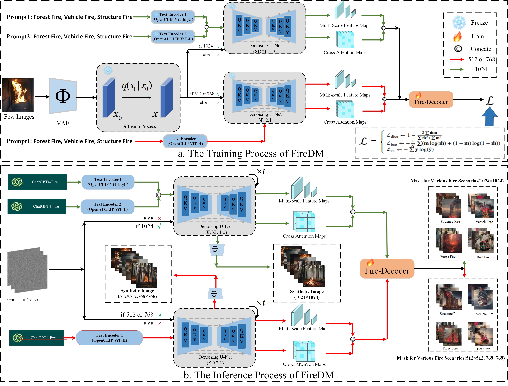

# FireDM
Official code for 'FireDM: A Few-Shot Learning Fire Segmentation Framework based on the Diffusion Model'
<p align="center">
  
<br>
</p>


## Our Contribution
- [x] We propose a data augmentation framework FireDM, that can train to generate an infinite fire segmentation dataset with minimal reliance on a training dataset.
- [x] We have utilized the FireDM framework to create the largest and highest-quality fire segmentation dataset in the world to date. This dataset encompasses forest fires, vehicle fires, and building fires. The download link for this dataset is: [Link](https://drive.google.com/drive/folders/1e46hXXlSvTxf8O2wJJotvPeEnZW8Jj5C?usp=drive_link).

## :hammer_and_wrench: Getting Started

### Installation
```sh
conda create -n FireDM python=3.8
```
CUDA==11.3, CUDNN==8.2.0
Install the corresponding torch==1.10.2, please refer to [pytorch](https://pytorch.org/get-started/previous-versions/).
Such as:
```sh
pip install torch==1.10.2+cu113 torchvision==0.11.3+cu113 torchaudio==0.10.2+cu113 -f https://download.pytorch.org/whl/torch_stable.html  
```
Then install other packages:
```sh
python -m pip install -r requirements.txt
```

Select one of the following pre-training weight files: [Stable Diffusion 1.4](https://huggingface.co/CompVis/stable-diffusion-v1-4/tree/main), [Stable Diffusion 1.5](https://huggingface.co/runwayml/stable-diffusion-v1-5/tree/main), [Stable Diffusion 2.0](https://huggingface.co/stabilityai/stable-diffusion-2-base/tree/main), [Stable Diffusion 2.1](https://huggingface.co/stabilityai/stable-diffusion-2-1/tree/main), [Stable Diffusion XL base-0.9](https://huggingface.co/stabilityai/stable-diffusion-xl-base-0.9/tree/main), [Stable Diffusion XL Refiner-0.9](https://huggingface.co/stabilityai/stable-diffusion-xl-refiner-0.9/tree/main), [Stable Diffusion XL Base-1.0](https://huggingface.co/stabilityai/stable-diffusion-xl-base-1.0/tree/main), [Stable Diffusion XL Refiner-1.0](https://huggingface.co/stabilityai/stable-diffusion-xl-refiner-1.0) and place them in the ```./dataset/ckpts``` directory.


### Training Dataset Prepare
- I have placed the [BoWFire](https://ieeexplore.ieee.org/abstract/document/7314551) dataset used for training in a standardized format under the [Link](https://drive.google.com/file/d/1lilG-1MkrV6wLILSVZDuMMz-4wQiqjCb/view?usp=sharing), and you can follow this example to configure the contents of the dataset yourself to fit your project.

The overall format arrangement is consistent with the VOC dataset:


```
data/
    PascalVOC12/
	JPEGImages
	SegmentationClassAug
	splits/
	     train_aug.txt
```


Besides, you also need to order the prompt txt files as follows:

```
dataset/
	Prompts_From_GPT/
		VOC/
                  fire.txt
```

### Running Command
Training the Mask-deocder, or we also provide the [trained weight](https://drive.google.com/file/d/1sfk0DHxg6oDVhmkCYH1SJ0UnAmKVf8Oa/view?usp=drive_link) with BoWFire.


```sh
# For Training Mask-Decoder
sh ./script/train.sh
```


```sh
# Generate synthetic data for VOC
sh ./script/generation.sh
```

```sh
# Visualization of generative data
python ./Results/combine.py
```

 ## Acknowledgements
This work draws inspiration from the following contributions. We express our gratitude for these outstanding contributions and encourage citation of the following works when referencing our own:

- [Grounded-Diffusion](https://github.com/Lipurple/Grounded-Diffusion)
- [Mask2Former](https://github.com/facebookresearch/Mask2Former) 
- [GenPromp](https://github.com/callsys/GenPromp)
- [Depthformer](https://github.com/zhyever/Monocular-Depth-Estimation-Toolbox/tree/633580d0ed7395734a034abfebf2ddb6ad579d75/configs/depthformer)
- [DeepFashion-MM](https://github.com/yumingj/DeepFashion-MultiModal)
- [DatasetDM](https://github.com/showlab/DatasetDM)


<!--## Citation

```
@article{wu2023datasetdm,
  title={DatasetDM: Synthesizing Data with Perception Annotations Using Diffusion Models},
  author={Wu, Weijia and Zhao, Yuzhong and Chen, Hao and Gu, Yuchao and Zhao, Rui and He, Yefei and Zhou, Hong and Shou, Mike Zheng and Shen, Chunhua},
  journal={Thirty-seventh Conference on Neural Information Processing Systems (NeurIPS 2023)},
  year={2023}
}
``` -->

